<picture>
  <source media="(prefers-color-scheme: dark)" srcset="./assets/jarvis-dark.svg">
  <source media="(prefers-color-scheme: light)" srcset="./assets/jarvis-light.svg">
  
</picture>

<div align="center">

[](https://github.com/lucifer9973/DPI-Engine---Deep-Packet-Inspection-System)
[](https://github.com/lucifer9973/Fuel-route)
[](https://github.com/lucifer9973?tab=repositories)

[](https://linkedin.com/in/shobhit-raj9973)
[](https://github.com/lucifer9973)
[](mailto:rajshobhit48@gmail.com)

</div>

<!--
The full dashboard above is intentionally the profile itself.
Native GitHub links are kept immediately below the SVG because GitHub renders
SVG files through , where internal SVG links are not consistently interactive.
-->

<details>
<summary><b>▸ OPEN SYSTEM MANIFEST</b></summary>

<br>

```yaml
IDENTITY:
  operator: Shobhit Raj
  role: Product Engineer
  education: B.Tech CSE // KIIT // 2026

CORE_MODULES:
  backend: [Python, FastAPI, REST APIs, Node.js, Express.js]
  systems: [C++, Multithreading, Concurrency, Computer Networks]
  data: [SQL, MySQL, MongoDB]
  ai: [LLM Applications, RAG, Pinecone, Vector Databases]
  infrastructure: [Docker, AWS, Linux, Git]

CURRENT_NODE:
  organization: Spectent Services Pvt. Ltd.
  mission: Digital Inspection // Asset Management // Workflow Automation

STATUS: ONLINE
```

</details>

<div align="center">

`J.A.R.V.I.S // DEVELOPER INTERFACE`

**BUILD • BREAK • LEARN • IMPROVE • SHIP**

</div>
