<picture>
  <source media="(prefers-color-scheme: dark)" srcset="./assets/dark.svg">
  <source media="(prefers-color-scheme: light)" srcset="./assets/light.svg">
  
</picture>

<div align="center">

### `PRODUCT ENGINEER` · `BACKEND` · `AI / LLM` · `SYSTEMS`

> Building systems that feel less like software and more like technology from the future.

[](https://linkedin.com/in/shobhit-raj9973)
[](https://github.com/lucifer9973)

</div>

---

## `> SYSTEM.PROFILE`

```yaml
identity: Shobhit Raj
class: Product Engineer
current_node: Spectent Services Pvt. Ltd.
education: B.Tech CSE // KIIT // 2026

primary_systems:
  - Backend Engineering
  - REST API Architecture
  - AI / LLM Applications
  - RAG & Vector Search
  - Systems Programming
  - Computer Networks

runtime:
  languages: [Python, C++, Java, JavaScript, SQL]
  backend: [FastAPI, Node.js, Express]
  infrastructure: [Docker, AWS, Linux, Git]
  intelligence: [LLMs, RAG, Pinecone, Vector Databases]

status: ONLINE
mission: BUILD → BREAK → LEARN → IMPROVE → SHIP
```

## `> SELECTED.SYSTEMS`

### `01 // DEEP PACKET INSPECTION ENGINE`
Multithreaded C++ traffic-analysis engine supporting **TCP · UDP · HTTP · HTTPS · DNS · IPv4 · TLS** across 15+ modular components.

[ACCESS REPOSITORY →](https://github.com/lucifer9973/DPI-Engine---Deep-Packet-Inspection-System)

### `02 // INTELLIGENT DOCUMENT ASSISTANT`
AI document intelligence system built with **FastAPI · Pinecone · Groq · RAG · semantic search**, including 6+ REST APIs and 1536-dimensional vector retrieval.

### `03 // FUEL ROUTE OPTIMIZATION`
Backend routing system for intelligent fuel-stop selection, cost estimation, and route previews.

[ACCESS REPOSITORY →](https://github.com/lucifer9973/Fuel-route)

---

<div align="center">


### `// END TRANSMISSION`

**SYSTEM ONLINE · READY TO BUILD**

</div>
