<picture>
  <source media="(prefers-color-scheme: dark)" srcset="./assets/hero-dark.svg">
  <source media="(prefers-color-scheme: light)" srcset="./assets/hero-light.svg">
  
</picture>

<br>

<div align="center">
  
  `J.A.R.V.I.S // DEVELOPER OPERATING SYSTEM // v4.2`
  
  **BUILD** • **BREAK** • **LEARN** • **IMPROVE** • **SHIP**

</div>

---

```yaml
IDENTITY:
  operator: Shobhit Raj
  role: Product Engineer
  mission: Building Backend Systems, AI Applications and Products that Scale

CORE_MODULES:
  backend: [Python, FastAPI, REST APIs, Node.js, Express.js]
  systems: [C++, Multithreading, Concurrency, Computer Networks]
  data: [SQL, MySQL, MongoDB, PostgreSQL]
  ai: [LLM Applications, RAG, Pinecone, Vector Databases, LangChain]
  infrastructure: [Docker, AWS, Linux, Git, CI/CD]

CURRENT_NODE:
  organization: Spectent Services Pvt. Ltd.
  focus: Backend Engineering // AI Applications // Product Development // System Design

NETWORK:
  education: B.Tech CSE @ KIIT University (2026)
  linkedin: https://linkedin.com/in/shobhit-raj9973
  email: rajshobhit48@gmail.com
  portfolio: (placeholder)

STATUS: ONLINE // AVAILABLE FOR OPPORTUNITIES
```

<br>

## ▸ CURRENT MISSION

```diff
+ Building scalable backend systems and AI-powered products
+ Engineering intelligent document processing solutions
+ Developing real-time inspection and analytics platforms
! Exploring advanced RAG architectures and vector databases
! Contributing to open-source developer tools
```

I'm a Product Engineer passionate about architecting robust backend systems, designing intelligent AI applications, and building products that solve real problems at scale. Currently engineering at **Spectent Services Pvt. Ltd.** , working on digital inspection platforms, asset management systems, and workflow automation.

<br>

## ▸ PROFESSIONAL EXPERIENCE

```
┌─────────────────────────────────────────────────────────┐
│  PRODUCT ENGINEER INTERN                  2024 - Present │
│  SPECTENT SERVICES PVT LTD                              │
├─────────────────────────────────────────────────────────┤
│  > Architecting digital inspection platform              │
│  > Building scalable backend microservices               │
│  > Implementing RAG-based document intelligence          │
│  > Designing asset management & workflow automation      │
└─────────────────────────────────────────────────────────┘

┌─────────────────────────────────────────────────────────┐
│  LLM POST TRAINING INTERN                      2024     │
│  ETHARA AI                                              │
├─────────────────────────────────────────────────────────┤
│  > LLM fine-tuning and post-training pipelines           │
│  > Data preparation and model evaluation                 │
│  > Reinforcement learning from human feedback (RLHF)    │
└─────────────────────────────────────────────────────────┘
```

<br>

## ▸ TECH STACK & EXPERTISE

<div align="center">

| Category | Technologies |
|----------|-------------|
| **Languages** | `Python` `C++` `JavaScript` `SQL` |
| **Backend** | `FastAPI` `Node.js` `Express.js` `REST APIs` |
| **AI / ML** | `LLM Applications` `RAG` `LangChain` `Vector Databases` `Pinecone` |
| **Databases** | `MySQL` `MongoDB` `PostgreSQL` |
| **Infrastructure** | `Docker` `AWS` `Linux` `Git` `CI/CD` |
| **Systems** | `Multithreading` `Concurrency` `Computer Networks` |

</div>

<br>

## ▸ PROJECT MATRIX

<div align="center">

### `01` DEEP PACKET INSPECTION ENGINE
*C++ • Multithreading • Network Analysis*
[](https://github.com/lucifer9973/DPI-Engine---Deep-Packet-Inspection-System)

### `02` INTELLIGENT DOCUMENT ASSISTANT
*FastAPI • RAG • Pinecone • Groq*
[](https://github.com/lucifer9973)

### `03` FUEL ROUTE OPTIMIZATION SYSTEM
*Django • Routing Algorithms • Cost Optimization • Maps*
[](https://github.com/lucifer9973/Fuel-route)

### `04` PREDICTIVE ANALYTICS ENGINE
*Machine Learning • Data Analysis • Feature Engineering*

### `05` CUSTOMER SEGMENTATION SYSTEM
*ML • Clustering • Business Intelligence*

### `06` REAL-TIME FACE DETECTION
*FastAPI • WebSocket • Computer Vision • OpenCV*

[](https://github.com/lucifer9973?tab=repositories)

</div>

<br>

## ▸ ACHIEVEMENTS & CERTIFICATIONS

<div align="center">

[](https://github.com/lucifer9973)
[](https://github.com/lucifer9973)
[](https://github.com/lucifer9973)

</div>

<br>

## ▸ GITHUB ANALYTICS

<div align="center">
  
  
</div>

<br>

## ▸ CONTRIBUTION GRAPH

<div align="center">
  
</div>

<br>

## ▸ CONNECT

<div align="center">

[](https://linkedin.com/in/shobhit-raj9973)
[](https://github.com/lucifer9973)
[](mailto:rajshobhit48@gmail.com)
[](https://lucifer9973.github.io)

</div>

<br>

---

<div align="center">

```
J.A.R.V.I.S // DEVELOPER INTERFACE v4.2
SHOBHIT RAJ // PRODUCT ENGINEER
BACKEND // AI // SYSTEMS // PRODUCTS

BUILD • BREAK • LEARN • IMPROVE • SHIP
```

```
> system.status
ONLINE // AVAILABLE FOR OPPORTUNITIES

> system.bootime
2024 // CONTINUOUSLY OPERATIONAL

> system.motto
"Building Backend Systems, AI Applications and Products that Scale."
```

</div>

<br>

<details>
<summary><b>▸ SYSTEM INFORMATION</b></summary>

<br>

```yaml
operator: Shobhit Raj
role: Product Engineer
education: B.Tech Computer Science // KIIT University // 2026

current_organization: Spectent Services Pvt. Ltd.
current_focus:
  - Backend Engineering with FastAPI & Python
  - AI Application Development
  - Product Design & System Architecture
  - Scalable Distributed Systems

previous_experience:
  - LLM Post Training Intern @ Ethara AI

technical_proficiencies:
  languages: [Python, C++, JavaScript, SQL]
  frameworks: [FastAPI, Node.js, Express.js, Django]
  databases: [MySQL, MongoDB, PostgreSQL]
  ai_ml: [LLMs, RAG, LangChain, Pinecone, Vector Databases, Machine Learning]
  devops: [Docker, AWS, CI/CD, Linux, Git]
  systems: [Multithreading, Concurrency, Computer Networks, REST API Design]

projects:
  - Deep Packet Inspection Engine [C++]
  - Intelligent Document Assistant [FastAPI, RAG, Pinecone]
  - Fuel Route Optimization [Django]
  - Predictive Analytics [ML]
  - Customer Segmentation [ML]
  - Real-Time Face Detection [FastAPI, WebSocket]

status: Online // Open for collaboration & opportunities
```

</details>

<br>

<div align="center">

<a href="https://github.com/lucifer9973/lucifer9973">
  
</a>

<br>

<sub>**J.A.R.V.I.S Developer Interface** — Designed with precision. Built with purpose. Powered by caffeine and curiosity.</sub>

</div>
